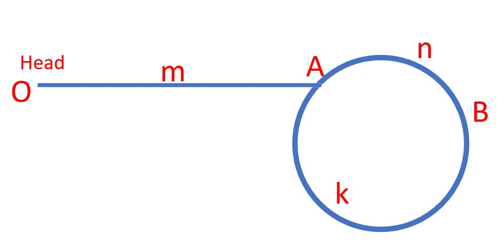

# [142. Linked List Cycle II](https://leetcode-cn.com/problems/linked-list-cycle-ii/)

Given a linked list, return the node where the cycle begins. If there is no cycle, return null.

There is a cycle in a linked list if there is some node in the list that can be reached again by continuously following the next pointer. Internally, pos is used to denote the index of the node that tail's next pointer is connected to. Note that pos is not passed as a parameter.

Notice that you should not modify the linked list.

 

**Example 1:**


```c++
Input: head = [3,2,0,-4], pos = 1
Output: tail connects to node index 1
Explanation: There is a cycle in the linked list, where tail connects to the second node.
```
**Example 2:**


```c++
Input: head = [1,2], pos = 0
Output: tail connects to node index 0
Explanation: There is a cycle in the linked list, where tail connects to the first node.
```
**Example 3:**


```c++
Input: head = [1], pos = -1
Output: no cycle
Explanation: There is no cycle in the linked list.
```

**Constraints:**

The number of the nodes in the list is in the range [0, 104].

-105 <= Node.val <= 105

pos is -1 or a valid index in the linked-list.
 

**Follow up:**

Can you solve it using O(1) (i.e. constant) memory?

```c++
//Definition for singly-linked list.
struct ListNode {
    int val;
    ListNode *next;
    ListNode() : val(0), next(nullptr) {}
    ListNode(int x) : val(x), next(nullptr) {}
    ListNode(int x, ListNode *next) : val(x), next(next) {}
};
```

# Solution1-Fast slow pointer I

```c++
class Solution {
public:
    ListNode *detectCycle(ListNode *head) {
        ListNode* cur1 = head;
        ListNode* cur2 = head;
        if(cur1 == nullptr) return NULL;
        do{
            if(((cur1 -> next == nullptr))||(cur1 -> next -> next == nullptr))return NULL;
            cur1 = cur1 -> next ->next;
            cur2 = cur2 -> next;
        }while((cur1 != cur2));
        cur1 = head;
        while((cur1 != cur2)){
            cur1 = cur1 -> next;
            cur2 = cur2 -> next;
        }
        return cur1;
    }
};
```

# Solution2-Fast slow pointer II

```c++
class Solution {
public:
    ListNode *detectCycle(ListNode *head) {
        ListNode* fast = head;
        ListNode* slow = head;
        while(fast != NULL && fast->next != NULL) {
            slow = slow->next;
            fast = fast->next->next;
            // 快慢指针相遇，此时从head 和 相遇点，同时查找直至相遇
            if (slow == fast) {
                ListNode* index1 = fast;
                ListNode* index2 = head;
                while (index1 != index2) {
                    index1 = index1->next;
                    index2 = index2->next;
                }
                return index2; // 返回环的入口
            }
        }
        return NULL;
    }
};
```

# Idea

* Both solutions above use the method "Fast Slow Pointer", Solution1 is mine, but the methed II is smarter
* Here are two pointers, faster one takes two steps each time, and slower one takes one
* If there is a circle in the list, the two pointers must meet in it
* As shown in the figure below, when the two pointers meet, the faster one took `OA + AB + λ*circle`, which is `m + n + λ(n+k)`, the slower one took `OA + AB`, which is `m + n`
* The fast pointer passes twice as many nodes as the slow pointer, so here is the equation:`m + n + λ(n+k) = 2(m + n)`, after simplification, it is `m = (λ - 1)(n + k)`



* **From the above equation, we can draw a conclusion:
if two points, starting from point O and point B, step by step respectively, they must meet at point A**

# Note

When I finished my solution, I found that the official solution is a little smarter than mine

It uses "whether the pointer is valid or not" as the loop judgment condition, and "whether the pointer is equal or not" as the if statement judgment condition

My solution is just the opposite, which leads to the need for more judgment to deal with extreme situations
