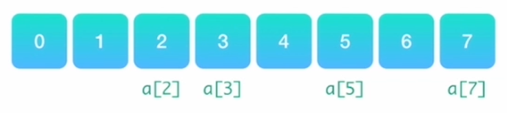

# Data Structure

# 数组、字符串

## 数组

优点：

1. 能在O(1)的时间里根据数组下标查询某个元素
2. 构建数组非常简单

缺点：

1. 构建时必须分配一段连续的空间
2. 查询某个元素是否存在是需要遍历整个数组，耗费O(n)的时间



Note：

- 数组是存放在连续空间上的相同类型数据的集合
- 正因为数组的内存空间地址是连续的，所以在删除或者增加元素的时候，就难免要移动其他元素的地址


## 字符串

## 练习题：242. 有效的字母异位词

思路：可建立字母表，词A在字母表加计数，词B在字母表减计数，最终为0则为true


# 栈

## 特点

- **后进先出（LIFO）**
- 所有操作都是在栈的顶部完成的，只可以查看栈顶元素，只可以在栈顶压入或者弹出数据

## 算法基本思想

- **可以用单链表实现**

在：

1. 只关心上一次操作
2. 在操作完成后，需向前查找到更前一次的操作

可用栈操作，时间复杂度为O(1)


## 练习题：20. 有效的括号


## 练习题：739. 每日温度


# 队列

## 特点

- **先进先出（FIFO）**
- 只允许在队尾查看和添加数据，在队头查看和删除数据


## 算法基本思想

使用双链表

在：

1. 需要按照一定的顺序来处理数据
2. 要处理的数据在不断的变化时

**常用场景：广度优先搜索**

## 双端队列

### 特点

- 可以利用一个双链表实现
- 队列的头尾两端可以在O(1)的时间内进行数据的查看、添加和删除


### 常用场景

实现一个长度动态变化的窗口或者连续区间

### 练习题：239. 滑动窗口最大值


# 树

## 树的共性

- **结构直观**
- 通过树问题来考察递归算法掌握的熟练程度

## 常考树的形状

- 普通二叉树


- 平衡二叉树


- 完全二叉树


- 二叉搜索树


- 四叉树


- 红黑树、自平衡二叉搜索树（少见）


## 树的遍历

### 前序遍历

根节点→左子树→右子树


用途：

1. 树中搜索
2. 创建新的树

### 中序遍历

左子树→根节点→右子树


用途：

1. 二叉搜索树

### 后序遍历

左子树→右子树→根节点


用途：

1. 收集的信息是自底向上不断进行

## 练习题：230. 二叉搜索中第K小的元素（后序遍历）

# 优先队列

常见面试考点，实现过程较为繁琐，在解决面试中的问题时，可实行“拿来主义”

## 特点

与普通队列相比：

1. 保证每次取出的元素是队列中优先级最高的
2. 优先级别可自定义

## 最常用的场景

从杂乱无章的数据中按照一定的顺序（或者优先级）筛选数据

eg：从一堆数中取出K个最大的数，

排序的复杂度为O(nlogn)，使用优先队列复杂度为O(k+logk)

## 本质

二叉堆的结构：利用一个数组结构来实现完全二叉树

## 特性

数组里的第一个元素array[0]拥有最高的优先级

给定一个下标i，那么对于元素array[i]而言

- **父节点**：对应的元素下标是 (i - 1) / 2
- **左侧子节点**：对应的元素下标是 2 * i +1
- **右侧子节点**：对应的元素下标是 2 * i + 2
- **Note**：数组每个元素的优先级都必须高于它两侧子节点

## 最基本操作为：

### 向上筛选

- 当有新的数据加入到优先队列中，新的数据首先被放置在二叉堆的底部。
- 不断进行向上筛选的操作，即如果发现该数据的优先级别比父节点的优先级别还要高，那么就和父节点的元素相互交换，再接着往上进行比较，直到无法再继续交换为止。

### 向下筛选

- 当堆顶的元素被取出时，要更新堆顶的元素来作为下一次按照优先级顺序被取出的对象，需要将堆底部的元素放置到堆顶，然后不断地对它执行向下筛选的操作。
- 将该元素和它的两个孩子节点对比优先级，如果优先级最高的是其中一个孩子，就将该元素和那个孩子进行交换，然后反复进行下去，直到无法继续交换为止。

## 初始化

结论：初始化一个大小为n的堆，所需时间复杂度为O(n)

## 练习题：347. 前 K 个高频元素


# 图

被广泛运用的数据结构，如大数据问题等

## 必会知识点

1. 图的存储和表达方式：**邻接矩阵、邻接链表**
2. 图的遍历：**深度优先、广度优先**
3. 二部图的检测(Bipartite)、树的检测、环的检测：**有向图、无向图**
4. **拓扑排序**
5. **联合-查找算法(Union-Find)**
6. 最短路径：**Dijkstra、Bellman-Ford（可只掌握何时用哪个）**

## 练习题：785. 判断二分图


# 前缀树

出现在面试的难题中，要求能熟练地书写其实现以及运用

## 基本概念

1. 字典查找：比如，给定一系列构成字典的字符串，要求在字典中找出所有以“ABC”开头的字符串

    假设N个单词、开头平均长度为M

    - ①：暴力搜索法  时间复杂度：O(M*N)
    - ②：前缀树  时间复杂度：O(M)
2. 也称字典树：被广泛地运用在字典查找当中

假如有一个字典，

- 字典里面有一些单词，
- 每个单词还能有自己的一些权重值

那么用前缀树来构建这个字典如下：


## 重要性质

每个节点至少包含两个基本属性

1. **children**：数组或者集合，罗列出每个分支当中包含的所有字符
2. **isEnd**：布尔值，表示该节点是否为某字符串的结尾

Note：根节点是空的，除了根节点，其他所有节点都有可能是单词的结尾，叶子节点一定是单词的结尾

## 最基本的操作

### 创建

**方法**：

1. 遍历一遍输入的字符串，对每个字符串的字符进行遍历
2. 从前缀树的根节点开始，将每个字符加入到节点的children字符集当中
3. 如果字符集已经包含了这个字符，跳过
4. 如果当前字符是字符串的最后一个，把当前节点的isEnd标记为真

**Note**：每个节点还能用来保存额外的信息，比如可以用来记录拥有相同前缀的所有字符串。
            因此，当用户输入某个前缀时，就能在 O(1) 的时间内给出对应的推荐字符串。、

### 搜索

方法：从前缀树的根节点出发，逐个匹配输入的前缀字符，遇到了就向下层搜索，没遇到直接返回

## 练习题：212. 单词搜索 II


# 线段树

应用场合比较明确，场景较为丰富

## 从例题出发

假设有一个数组array[0 ... n-1]，里面有n个元素，现在要经常对该数组做以下两件事

1. 更新数组元素的数值
2. 求数组**任意一段区间里**元素的总和（或者平均值）

方法一：遍历 → 时间复杂度 O(n)

方法二：线段树 → 时间复杂度 O(logn)

## 定义

- 一种按照二叉树的形式存储数据的结构，
- 每个节点保存的都是数组里某一段的总和
- 也即每个节点记录的区间是数组下标所形成的区间

eg：数组是[1,3,5,7,9,11]


## 练习题：315. 计算右侧小于当前元素的个数

如果把分段的区间设计成按照数值的大小来划分，并记录下在这个区间中的数的总和，就能快速地知道比当前数还要小的数有多少个。


# 树状数组

也被称为 Binary Indexed Tree，应用场合比较明确，场景较为丰富

## 从例题出发

假设有一个数组array[0 ... n-1]，里面有n个元素，现在要经常对该数组做以下两件事

1. 更新数组元素的数值
2. 求数组**前K个元素**的总和（或者平均值）

方法一：线段树

时间复杂度：O(logn)

方法二：树状数组

时间复杂度：O(logn) → 实现更加简单

## 重要的基本特征

- 利用数组来表示多叉树的结构，和优先队列有些类似
- 优先队列是用数组来表示完全二叉树，而树状数组是多叉树
- 树状数组的第一个元素是空节点
- 如果tree[y]是tree[x]的父节点，那么需要满足y=x-(x&(-x))

## 练习题：308. 二维区域和检索 - 可变

求一个动态变化的二维矩阵里，任意子矩阵里的数的总和。

# 排序

## 基本排序算法

1. 冒泡排序（Bubble Sort）
2. 插入排序（Insertion Sort）

简单直接写出没有bug的代码

## 常考排序

1. 归并排序（Merge Sort）
2. 快速排序（Quick Sort）
3. 拓扑排序（Topological Sort）

解决大部分设计排序问题的关键

## 其他排序算法

1. 堆排序（Heap Sort）
2. 桶排序（Bucket Sort)

掌握好解题思想可以扩充解题思路

## 冒泡排序

### 基本思想

1. 每一轮，从杂乱无章的数组头部开始，每两个元素比较大小并进行交换，
2. 直到这一轮当中最大或最小的元素被放置在数组的尾部
3. 然后不断重复该过程，直到所有元素都排好位置

### 复杂度

- 空间复杂度：O(1)
- 时间复杂度：O(n^2)

```cpp
void sort(int[] nums) {
    //定义一个布尔变量 hasChange，用来标记每轮遍历中是否发生了交换
    boolean hasChange = true; 

    //每轮遍历开始，将 hasChange 设置为 false
    for (int i = 0; i < nums.length - 1 && hasChange; i++) {
        hasChange = false;

        //进行两两比较，如果发现当前的数比下一个数还大，那么就交换这两个数，同时记录一下有交换发生
        for (int j = 0; j < nums.length - 1 - i; j++) {
            if (nums[j] > nums[j + 1]) {
                swap(nums, j, j + 1);
                hasChange = true;
            }
        }
     }
 }
```

## 插入排序

### 算法思想

不断地将尚未排好的数插入已经排好的部分

### 复杂度

- 空间复杂度：O(1)
- 时间复杂度：O(n^2)

```cpp
void sort(int[] nums) {
    // 将数组的第一个元素当作已经排好序的，从第二个元素，即 i 从 1 开始遍历数组
    for (int i = 1, j, current; i < nums.length; i++) {
        // 外围循环开始，把当前 i 指向的值用 current 保存
        current = nums[i];

        // 指针 j 内循环，和 current 值比较，若 j 所指向的值比 current 值大，则该数右移一位
        for (j = i - 1; j >= 0 && nums[j] > current; j--) {
            nums[j + 1] = nums[j];
            }
    
        // 内循环结束，j+1 所指向的位置就是 current 值插入的位置
        nums[j + 1] = current;
    }
}
```

## ※归并排序

### 算法思想

1. 把一个复杂问题分成若干个子问题来求解
2. 把数组从中间划分成两个字数组
3. 一直递归地把子数组划分成更小的子数组，直到子数组里面只有一个元素
4. 依次按照递归的返回顺序，不断地合并排好序的子数组，直到最后把整个数组的顺序排好

### 复杂度

- 时间复杂度：T(n) = 2*T(n/2) + O(n) = O(nlogn)
- 空间复杂度：O(n)

```cpp
//主体函数
void sort(int[] A, int lo, int hi) {
  // 判断是否只剩下最后一个元素
  if (lo >= hi) return;
  
  // 从中间将数组分成两个部分
  int mid = lo + (hi - lo) / 2;
  
  // 分别递归地将左右两半排好序
  sort(A, lo, mid);
  sort(A, mid + 1, hi);

  // 将排好序的左右两半合并  
  merge(A, lo, mid, hi);
}
```

```cpp
//归并操作
void merge(int[] nums, int lo, int mid, int hi) {
    // 复制一份原来的数组
    int[] copy = nums.clone();
  
    // 定义一个 k 指针表示从什么位置开始修改原来的数组，i 指针表示左半边的起始位置，j 表示右半边的起始位置
    int k = lo, i = lo, j = mid + 1;
  
    while (k <= hi) {
        if (i > mid) {
            nums[k++] = copy[j++];
        } else if (j > hi) {
          nums[k++] = copy[i++];
        } else if (copy[j] < copy[i]) {
          nums[k++] = copy[j++];
        } else {
          nums[k++] = copy[i++];
        }
    }
}
```


## 快速排序


### 算法思想

1. 直接在原数组操作，会改变原值
2. 快速排序也采用了分治的思想
3. 把原始的数组筛选成较小和较大的两个子数组，然后递归地排序两个子数组
4. 在分成较小和较大的两个子数组的过程中，如何选定一个基准值尤为关键

### 复杂度

- 时间复杂度：O(nlogn) ~ O(n^2)
- 空间复杂度：O(logn)


```cpp
//主体函数
void sort(int[] nums, int lo, int hi) {
    if (lo >= hi) return; // 判断是否只剩下一个元素，是，则直接返回
    
    // 利用 partition 函数找到一个随机的基准点
    int p = partition(nums, lo, hi);
    
    // 递归地对基准点左半边和右半边的数进行排序
    sort(nums, lo, p - 1);
    sort(nums, p + 1, hi);
}
```

```cpp
//partition
int partition(int[] nums, int lo, int hi) {
    // 随机选择一个数作为基准值，nums[hi] 就是基准值
    swap(nums, randRange(lo, hi), hi);

    int i, j;

    // 从左到右用每个数和基准值比较，若比基准值小，则放到指针 i 所指向的位置。循环完毕后，i 指针之前的数都比基准值小
    for (i = lo, j = lo; j < hi; j++) {
        if (nums[j] <= nums[hi]) {
            swap(nums, i++, j);
        }
    }

    // 末尾的基准值放置到指针 i 的位置，i 指针之后的数都比基准值大
    swap(nums, i, j);

    // 返回指针 i，作为基准点的位置
    return i;
}
```

### 练习题：215. 给定一个尚未排序好的数组，要求找出第k大的数

1. 直接将数组进行排序，而后得出结果
2. 快速排序

## 拓扑排序

### 应用场合

将图论里的顶点按照项链的性质进行排序

### 前提

1. 必须是有向图
2. 图里没有环


### 复杂度

- 时间复杂度：O(n)
- 空间复杂度：


```cpp
/*
运用广度优先搜索的方法对这个图的结构进行遍历。
在构建这个图的过程中，用一个链接矩阵 adj 来表示这个图的结构，
用一个 indegree 的数组统计每个顶点的入度，重点看如何实现拓扑排序。
*/
void sort() {
    Queue<Integer> q = new LinkedList(); // 定义一个队列 q

    // 将所有入度为 0 的顶点加入到队列 q
    for (int v = 0; v < V; v++) {
        if (indegree[v] == 0) q.add(v);
    }

    // 循环，直到队列为空
    while (!q.isEmpty()) {
        int v = q.poll();
        // 每次循环中，从队列中取出顶点，即为按照入度数目排序中最小的那个顶点
        print(v);

        // 将跟这个顶点相连的其他顶点的入度减 1，如果发现那个顶点的入度变成了 0，将其加入到队列的末尾
        for (int u = 0; u < adj[v].length; u++) {
            if (--indegree[u] == 0) {
                q.add(u);
            }
        }
    }
}
```

# 递归

## 基本性质

1. 函数调用本身
2. 把大规模的问题不断地变小，再进行推导的过程

## 示例：汉诺塔


```cpp
void hano(char A, char B, char C, int n) {
    if (n > 0) {
        hano(A, C, B, n - 1);
        move(A, C);
        hano(B, A, C, n - 1);
  }
}
```

## 算法思想

1. 懂得如何将一个问题的规模变小
2. 在利用小规模问题中得出的结果
3. 结合当前的值或者情况，得出最终的结果

## 理解（自顶向下 Top-Down）

1. 把要实现的递归函数，看成已经实现好的
2. 直接利用解决一些子问题
3. 并思考如何根据子问题的解以及当前面对的情况得出答案

## 练习题：91. 解码方法


```cpp
int numDecodings(String s) {

    if (s.charAt(0) == '0') return 0;

    char[] chars = s.toCharArray();
    return decode(chars, chars.length - 1);
}

// 字符串转换成字符数组，利用递归函数 decode，从最后一个字符向前递归
int decode(char[] chars, int index) {
    // 处理到了第一个字符,只能有一种解码方法，返回 1
    if (index <= 0) return 1;
        
    int count = 0;
        
    char curr = chars[index];
    char prev = chars[index - 1];
   
    // 当前字符比 “0” 大，则直接利用它之前的字符串所求得的结果     
    if (curr > '0') {
        count = decode(chars, index - 1);
    }
   
    // 由前一个字符和当前字符所构成的数字，值必须要在 1 到 26 之间，否则无法进行解码 
    if (prev == '1' || (prev == '2' && curr <= '6')) {
        count += decode(chars, index - 2);
    }
        
    return count;
}
```

## 递归函数思路总结

```cpp
function fn(n) {
    // 第一步：判断输入或者状态是否非法？
	  // 判断当前情况是否非法，如果是就立即返回，即完整性检查
    if (input/state is invalid) {
        return;
    }

    // 第二步：判读递归是否应当结束?
    // 判断是否满足结束递归的条件
    if (match condition) {
        return some value;
    }

    // 第三步：缩小问题规模
    // 将问题的规模缩小，递归调用
    result1 = fn(n1)
    result2 = fn(n2)
    ...

    // 第四步: 整合结果
    // 利用小规模问题中的答案，结合当前数据进行整合，得出最终答案
    return combine(result1, result2)
}
```

## 练习题：247. 中心对称数II


```cpp
List<String> helper(int n, int m) {
    // 第一步：判断输入或者状态是否非法？
    if (n < 0 || m < 0 || n > m) {
        throw new IllegalArgumentException("invalid input");
  }

    // 第二步：判读递归是否应当结束?
    if (n == 0) return new ArrayList<String>(Arrays.asList(""));
    if (n == 1) return new ArrayList<String>(Arrays.asList("0", "1", "8"));
  
    // 第三步：缩小问题规模
    List<String> list = helper(n - 2, m); 

    // 第四步: 整合结果
    List<String> res = new ArrayList<String>();
  
    for (int i = 0; i < list.size(); i++) {
        String s = list.get(i);
    
        if (n != m) res.add("0" + s + "0");
    
        res.add("1" + s + "1");
        res.add("6" + s + "9");
        res.add("8" + s + "8");
        res.add("9" + s + "6");
    }
  
    return res;
}
```

## 复杂度

### 迭代法

Note：如果出现分支（ if 等），取分支时间最大的，且时间为1个单位

举例：汉诺塔

```cpp
void hano(char A, char B, char C, int n) {
    if (n > 0) {
        hano(A, C, B, n - 1);
        move(A, C);
        hano(B, A, C, n - 1);
  }
}
```


算法执行时间：

 T(n) = 1 + T(n-1) + 1 = 2*T(n-1) + O(1)  = 2^n //if和move的执行时间不会随着n的增加而增加

### 公式法

当递归函数满足右侧公式时，可利用公式法

参数a,b 确定时，只看递归部分，时间复杂度就是$O(n^{log_b^a})$

f(n)指每次递归完毕后，额外的计算执行时间


示例：[https://www.notion.so/data-structure-13398fb90bd2465ab37413dac84ab08e#5ab0a0393c984a30955bb2143400c871](https://www.notion.so/data-structure-13398fb90bd2465ab37413dac84ab08e#5ab0a0393c984a30955bb2143400c871)

# 回溯

## 基本性质

1. 利用递归的性质
2. 从问题的起始点出发，不断尝试
3. 返回一步甚至多步再做选择，直到抵达终点的过程
4. 一步一步向前试探，每步探测进行评估，再决定是否继续

## 关键点

1. 出现非法的情况时，可退到之前的情景，可返回一步或者多步
2. 再去尝试别的路径和办法
3. 想要采用回溯算法，就必须保证：每次都有多种尝试的可能

## 解决问题的套路

```cpp
function fn(n) {

    // 第一步：判断输入或者状态是否非法？
/*
	首先判断当前情况是否非法，如果非法就立即返回
*/
    if (input/state is invalid) {
        return;
  }

    // 第二步：判读递归是否应当结束?
/*
	看看当前情况是否已经满足条件？如果是，就将当前结果保存起来并返回
*/
    if (match condition) {
        return some value;
  }

    // 遍历所有可能出现的情况
    for (all possible cases) {
  
        // 第三步: 尝试下一步的可能性
        solution.push(case)
        // 递归
        result = fn(m)

/*
	在当前情况下，遍历所有可能出现的情况，并进行递归
*/

        // 第四步：回溯到上一步
        solution.pop(case)
/*
	递归完毕后，立即回溯，回溯的方法就是取消前一步进行的尝试
*/
    }
    
}
```

## 练习题：39. 数组总和

给定一个无重复元素的数组 candidates 和一个目标数 target ，找出 candidates 中所有可以使数字和为 target 的组合。candidates 中的数字可以无限制重复被选取。

1. 在主函数中：
    1. 定义一个results数组来保存最终的结果
    2. 调用函数 backtracking，并将初始的情况以及 results 传递进去，这里的初始情况就是从第一个元素开始尝试，而且初始的子集为空。
2. 在backtracking函数中：
    1. 检查当前的元素总和是否已经超出了目标给定的值，每添加进一个新的元素时，就将它从目标总和中减去；
    2. 如果总和已经超出了目标给定值，就立即返回，去尝试其他的数值；
    3. 如果总和刚好等于目标值，就把当前的子集添加到结果中。
3. 在循环体内：
    1. 每次添加了一个新的元素，立即递归调用 backtracking，看是否找到了合适的子集
    2. 递归完毕后，要把上次尝试的元素从子集里删除，这是最重要的。

## 练习题：52. N皇后 II

## 复杂度

在一个 N×N 的国际象棋棋盘上放置 N 个皇后，每行一个并使她们不能互相攻击。给定一个整数 N，返回 N 皇后不同的的解决方案的数量。

- 回溯其实是用递归实现的，
    - 因此我们在分析回溯的时间复杂度时，其实就是在对递归函数进行分析

## Note

递归和回溯是重要考点之一，很多算法都有它们的影子：

- 二叉树的定义和遍历
- 归并排序、快速排序
- 动态规划
- 二分搜索

熟练掌握分析递归复杂度的方法，必须得有扎实的数学基础，比如牢记等差数列、等比数列等求和公式

# 深度优先搜索（DFS）

## 解决的问题

- 解决的是连通性的问题，即给定两个起始点，和一个终点，判断是否有一条路径从起点连接到终点
- 很多情况下，联通的路径有很多条，只需要找出一条即可，DFS只关心路径存在与否，不在乎其长短

## 算法的思想

- 从起点出发，选择一个可选方向不断向前，直到无法继续为止
- 然后尝试另外一种方向，直到最后走到终点
- DFS依赖栈这个数据结构（LIFO）

## 示例


## 例题分析


方法：

1. 判断是否抵达了目的地B，是则立即返回
2. 标记当前点已经被访问过了
3. 在规定的四个方向上进行尝试
4. 如果有一条路径被找到了，则返回true
5. 当尝试了所有的可能还没找到B，则返回false

## DFS实现

### 递归实现

1. 利用递归实现可以使得代码看上去很简洁
2. 递归的时候需要将当前程序中的变量以及状态压入到系统的栈里面
3. 压入和弹出栈都需要较多的时间，如果需要压入很深的栈，会造成运行效率低下

### 非递归实现

1. 栈的数据结构也支持压入和弹出操作
2. 完全可以利用栈来提高运行效率
3. 实现思路：
    1. 创建一个stack，用来将要被访问的点压入以及弹出
    2. 将起始点压入stack，并标记它被访问过
    3. 只要stack不为空，就不断地循环，处理每个点
    4. 从堆栈中取出当前要处理的点
    5. 判断是否抵达了目的地B，是的返回true
    6. 如果不是目的地，就从四个方向上尝试
    7. 将各个方向上的点压入堆栈，并标记为访问过
    8. 尝试了所有可能还没找到B，则返回false

## 复杂度分析

DFS是图论中的算法，分析复杂度的时候应借用图论的思想

- 邻接表（图里有V个顶点，E条边）

    访问所有顶点的时间为O(V)，查找所有顶点的邻居的时间为O(E)，所以总的时间复杂度为O(V+E)

- 邻接矩阵（图里有V个顶点，E条边）

    查找每个顶点的邻居需要O(V)的时间，所以查找整个矩阵的时间为O(V^2)

- 利用DFS在迷宫里找到一条路径
    - 时间复杂度：M*N个顶点，时间复杂度为O(M*N)
    - 空间复杂度：最坏情况为所有顶点都压入堆栈，空间复杂度为O(V) = O(M*N)

## DFS寻找最短路径


总体步骤：

1. 除A之外的所有0都用max替换
2. 对矩阵进行DFS遍历
3. 判断是否抵达B点

DFS步骤：

1. 判断是否找到B点
2. 从四个方向上进行尝试
3. 下个点数是否大于当前点步数+1
4. 是则更新下个点步数，并继续DFS

# 广度优先搜索（BFS）

## 算法关键

- 一般用来解决最短路径的问题
- 广度优先的搜索是从起始点出发，一层一层地进行
- 每层当中的点距离起始点的步数都是相同的
- 需要借用的数据结构是队列（FIFO）

## 双端BFS

- 同时从起始点和终点开始进行的广度优先的搜索称为双端BFS
- 双端BFS可以大大地提高搜索的效率

## 示例


## 步骤

1. 创建一个队列，将起始点加入队列中
2. 只要队列不为空，就一直循环下去
3. 在队列中取出当前要处理的点
4. 在四个方向上进行BFS搜索
5. 判断一下该方向上的点是否已经访问过了
6. 被访问过，则记录步数，并加入队列中
7. 找到目的地后立即返回

## 复杂度分析

同样借用图论的思想

- 邻接表（图里有V个顶点，E条边）

    每个顶点都要被访问一次，时间复杂度是O(V)，在访问每个顶点的时候，与其相连的顶点，也就是每条边，也都要被访问一次，所以加起来是O(E)，因此整体时间复杂度是O(V+E)

- 邻接矩阵（图里有V个顶点，E条边）

    查找每个顶点的邻居需要O(V)的时间，每次都要检查该顶点与其他顶点是否有联系，所以时间复杂度为O(V^2)

- 利用BFS在迷宫里找到一条路径
    - 时间复杂度：M*N个顶点，时间复杂度为O(M*N)
    - 空间复杂度：最坏情况为所有顶点都进入队列一次，空间复杂度为O(V) = O(M*N)

## 例题分析

从A走到B最多允许打通3堵墙，求最短路径的步数

- **暴力法：**

    枚举出所有拆墙的方法，对每个情况均进行BFS，找到最短的路径

- **非暴力法：**
    - 减少BFS的数量：
    1. 在不允许打通墙的情况下，只有一个人进行 BFS 搜索，时间复杂度是 n2；
    2. 允许打通一堵墙的情况下，分身为两个人进行 BFS 搜索，时间复杂度是 2×n2；
    3. 允许打通两堵墙的情况下，分身为三个人进行 BFS 搜索，时间复杂度是 3×n2；
    4. 允许打通三堵墙的情况下，分身为四个人进行 BFS 搜索，时间复杂度是 4×n2。
    - 解决关键问题
    1. 如果第一个人又遇到了一堵墙，那么他是否需要再次分身呢？不能。
    2. 第一个人怎么告诉第二个人可以去访问这个点？把这个点放入到队列中。
    3. 如何让 4 个人在独立的平面里搜索？利用一个三维矩阵记录每个层面里的点。


**步骤**：

1. 初始化变量，step记录步数，z记录level，用一个队列来存储要处理的各个层面的点，三维布尔数组记录各层面的点的被访问状况
2. 只要队列不为空就一直循环下去
3. 取出当前点，如遇到目的地则返回步数
4. 如果不是，朝四个方向尝试下一步
5. getLayer函数判断是否遇到可打通的墙壁
6. 若当前点是NULL，则继续下一步

**getLayer**函数：

- 如果当前遇到的是一堵墙，判断所打通的墙壁个数是否已经超出规定，如果没有，就将其打通，否则返回-1
- 如果当前遇到的不是一堵墙，就继续在当前的平面里进行BFS

# 动态规划

## 定义

1. 数学优化的方法
    1. 要解决的是问题的最优解
    2. 一个问题的最优解是由它的各个子问题的最优解决定的 → 最优子结构
    3. 一般由最优子结构，推导出一个**状态转移方程f(n)**，就能很快写出问题的递归实现方法

2. 编程的方法
    1. 保证每个重叠的子问题只会被求解一次
    2. 重叠子问题


## 练习题：300. 最长子序列的长度（上升子序列）

给定一个无序的整数数组，找到其中最长子序列长度。

示例

输入：[ 10, 9, 2, 5, 3, 7, 101, 18 ]             输出：4

即，最长的上升子序列是 [2, 3, 7, 101]，它的长度是 4。

**思路1**：暴力法

**思路2**：将问题的规模减少，推导出状态转移方程式

1. f(n)表示数组nums[0,1...,n-1]中的最长子序列
2. f(n-1)表示数组nums[0,1...,n-2]中的最长子序列
3. f(1)表示数组nums[0]的最长子序列


**难点：**

1. 如何定义f(n):

    该题中f(n)是以nums[n-1]结尾的最长的上升子序列的长度

2. 如何通过f(1)，f(2)，...，f(n-1)推导出f(n)，即状态转移方程
    - 拿num[n-1]与比它小的每一个值nums[i]作比较，其中1≤i<n，然后+1即可
    - 因此状态转移方程为

        $f(n)=max[f(i)]+1$，其中1≤i<n-1，且nums[i-1]<nums[n-1]

**解题步骤（递归）：**

1. 定义类，并首先定义一个静态变量max，用来保存最终的最长上升子序列的长度
2. 状态转移方程-f函数：
    1. 最基本的情况：
        - 数组长度为0时，无上升子序列
        - 数组长度为1时，最长上升子序列的长度为1
    2. 定义maxEndingHere，用于保存包含当前最后一个元素的情况下，最长的上升子序列的长度
    3. 从头遍历数组，递归求出以每个点为结尾的子数组中最长上升序列的长度
    4. 判断一下，若该数比当前数要小，就构成新的上升子序列，可能为最终的答案
    5. 最后返回以当前数结尾的上升子序列的最长长度

**解题步骤（记忆化递归）：**

1. 首先，定义一个哈希表cache，用来保存计算结果
2. 在每次调用递归函数的时候，判断一下对于这个输入，是否已经计算过了，也就是cache里是否已经保留了这个值，是的话，立即返回，否则，继续递归调用
3. 在返回当前结果前，保存到cache里，这样下次遇到同样的输入时，不必浪费时间计算

**NOTE：**

- 对于将问题规模不断减少的算法，称之为**自顶向下**的方法
- 由于递归的存在，程序运行时对堆栈的消耗以及处理很慢，实际工作中并不推荐

**解题步骤（非递归方法）：**

1. 用一个一维数组cache来存储计算过的结果
2. 初始化cache里的每个元素的值为1，表示每个元素作为结尾的最长子序列的长度初始化为1.
3. **自底向上**地切结每个问题的最优解
4. 比较
    - 拿遍历中遇到的每个元素nums[j]与nums[i]比较
    - 如果发现nums[j]<nums[i]
    - 说明nums[i]有机会构成上升序列
    - 如果新的上升序列比之前计算过的还要长，更新并保存到cache数组里
5. 用当前计算好的长度与全局的最大值进行比较
6. 最终得到最长的上升序列长度

## 动态规划解题难点

- 应当采用什么样的数据结构来保存什么样的计算结果（在缩小问题规模过程中进行的）
- 如何利用保存下来的计算结果推导出状态转移方程

## 1-线性规划

### 特点

- 各个子问题的规模以现行的方式分布
- 子问题的最佳状态或结果可以存储在一维线性的数据结构中，例如：一维数组，哈希表等
- 通常会用dp[i]表示第i个位置的结果，或者从0开始到第i个位置位置的最佳状态或结果

### 求解dp[i]的基本形式

- 当前所求的值仅仅依赖与有限个先前计算好的值，即dp[i]仅仅依赖于有限个dp[j]，其中j<i

    ### 练习题：70. 爬楼梯

    ### 练习题：198. 打家劫舍

    ### 练习题：62.不同路径

- 当前所求的值仅仅依赖与所有先前计算和的值，即dp[i]是各个dp[j]的某种组合，j∈[0,i-1]

    练习题：→最长上升子序列

## 2-区间规划

### 特点

- 各个子问题的规模由不同区间来定义
- 子问题的最佳状态或结果可以存储在二维数组中
- 这类问题的时间复杂度一般为多项式时间，即对于一个大小为n的问题，时间复杂度不会超过n的多项式倍数

    ### 练习题：516. 最长回文子序列

    **思路：**

    1. 定义dp矩阵

        dp[i][j]表示从字符串第i个字符到第j个字符之间的最长回文

    2. 初始化dp矩阵

        将对角线元素设为1，即单个字符的回文长度为1

    3. 从长度为2开始，尝试将区间扩大，一直到n
    4. 在扩大的过程中，每次都得出区间的起始位置i和结束位置j
    5. 比较一下区间首位的字符是否相等
    6. 如果相等，就加2，否则，从规模更小的字符串中得出最长的回文长度

## 3-约束规划

### **特点**

- 在普通的线性规划和区间规划里，一般由两种需求：统计和最优解
- 但是在很多情况下，题目会对输出结果的元素添加一定的限制或约束条件，增加了解题的难度。

### 举例：0-1背包问题（NP完全问题）

给定 n 个物品，每个物品都有各自的价值 vi 和重量 wi，现在给你一个背包，背包所能承受的最大重量是 W，那么往这个背包里装物品，问怎么装能使被带走的物品的价值总和最大。

# 二分搜索算法

## 简介

- 也称折半搜索，是在有序数组中查找某一特定元素的搜索算法
- 待求数组必须是排好序的
- 输入不一定是数组，也可能是给定区间的起始和终止位置

## 优缺点

**优点：**二分搜索也称对数搜索，其时间复杂度为O(lgn)，是很高效的搜索

**缺点：**要求待查找的数组或区间是排好序的

## 注意点

- 若要求对数组进行动态地删除和插入操作并完成查找，平均复杂度会变为O(n)
- 采取自平衡的二叉查找树
    1. 可在O(nlogn)的时间内用给定的数据构建出一棵二叉查找树
    2. 可在O(logn)的时间内对数据进行搜索
    3. 可在O(logn)的时间内完成删除和插入操作
- 当输入的数组或区间是有序的，并且不会经常变动，要求从中找出一个满足条件的元素，可采用二分搜索

## 基本解题模板（递归）

优点是简洁，缺点是执行消耗大

1. 二分搜索函数
    1. 不仅要指定数组nums和目标查找数target
    2. 还要指定查找区间的起点low和终点位置high
2. 为避免无限循环，开始时要判断一下：
    1. 如果起始点大于终点位置，表明这是一个非法区间，返回-1
    2. 如果已经尝试了所有的搜索区间还没找到结果，返回-1
3. 接下来，取正中间的数的下标middle
4. 判断一下正中间的数是否是target，是则返回middle
5. 如果发现目标数在左边，就递归地从左边进行二分搜索
6. 否则从右边递归地进行二分搜索
- 三个关键点
    1. 计算middle下标时，不能简单的用(low+high)/2，容易导致溢出
    2. 取左半边和右半边区间时，不需再加入middle
    3. 奇数数组取正中，偶数数组取正中靠左的数
- 时间复杂度：O(logn)

## 基本解题模板（非递归）

1. 在while循环中，判断一下搜索的区间是否有效
2. 计算正中间数的下标
3. 判断一下正好在正中间那个数是不是target，是则返回middle
4. 如果发现目标数在左边，调整搜索区间的终点为middle-1，否则为middle+1
5. 如果超出了搜索区间，表明无法找到目标数，返回-1

## 二分搜索的核心

1. 确定搜索的范围和区间
2. 取中间的数判断是否满足条件
3. 如果不满足条件，判定应该往哪个半边继续进行搜索

## 练习题：34. 最长子序列的长度

## 练习题：33. 旋转过的排序数组

# 贪婪算法

## 简介

- 在每一步选择中，都采取在当前状态下，最好或最优的选择，从而希望导致结果是最好或最优的算法
- **优点：**对于一些问题，贪婪算法非常直观有效
- **缺点：**往往得到的结果不是正确的，且容易过早的做出决定，从而没办法达到最优解

## 适用场景

只有当局部最优策略能产生全局最优策略的时候

## 练习题：253. 会议室II

# 高频真题

## 练习题：03. 找出不含有重复字符的最长子串的长度

## 练习题：04. 找出两个有序数组的中位数

## 练习题：23. 合并k个排好序的链表，返回合并后的排序链表。分析和描述算法的复杂度

## 练习题：56. 给出一个区间的集合，请合并所有重叠的区间

## 练习题：435. 给定一个区间的集合，找到需要移除区间的最小数量，使剩余区间互不重叠

## 练习题：269. 火星字典

## 练习题：772. 实现一个基本的计算器来计算简单的表达式字符串

## 练习题：10. 正则表达式匹配：给你一个字符串 s 和一个字符规律 p，请你来实现一个支持 '.' 和 '*' 的正则表达式匹配

## 练习题：84. 给定 n 个非负整数，用来表示柱状图中各个柱子的高度。每个柱子彼此相邻，且宽度为 1。求在该柱状图中，能够勾勒出来的矩形的最大面积

## 练习题：28. 实现 strStr() 函数。给定一个 haystack 字符串和一个 needle 字符串，在 haystack 字符串中找出 needle 字符串出现的第一个位置 (从 0 开始)。如果不存在，则返回 -1

## 练习题：336. 回文对：给定一组唯一的单词， 找出所有不同的索引对 (i, j)，使得列表中的两个单词， words[i] + words[j] ，可拼接成回文串

## 练习题：340. 给定一个字符串 s ，找出至多包含 k 个不同字符的最长子串 T

## 练习题：407. 给定一个 m x n 的矩阵，其中的值均为正整数，代表二维高度图每个单元的高度，请计算图中形状最多能接多少体积的雨水
